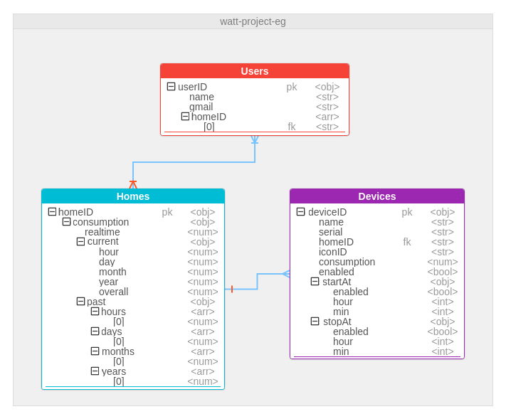
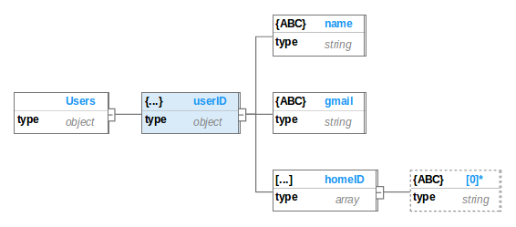
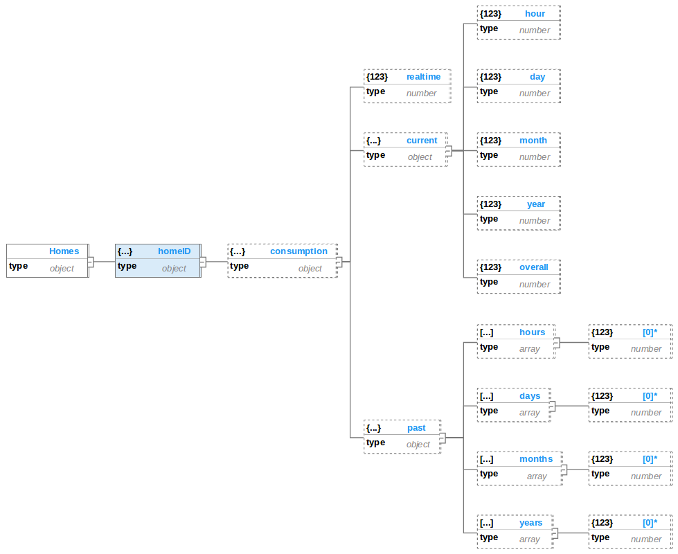
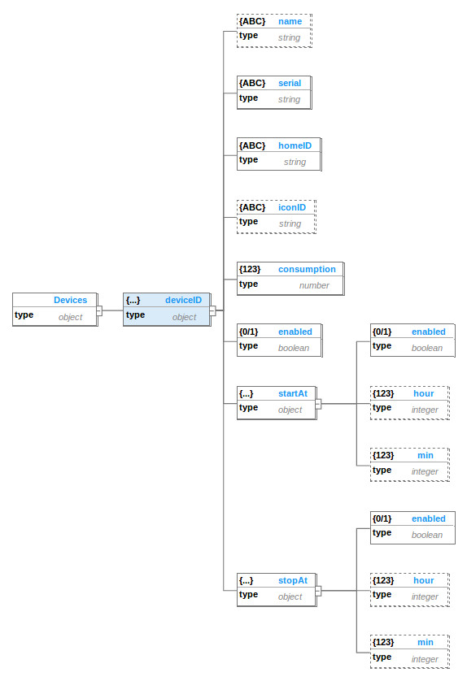
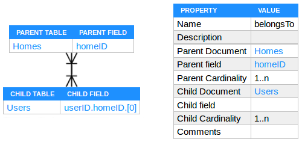
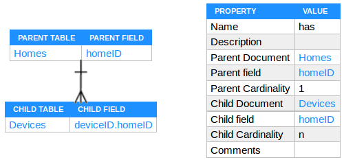

## Watt? Database

One of the services that Firebase provides is the realtime database. it is a cloud database where data is synced across all clients in realtime, and remains available when their apps goes offline. Firebase Realtime Database is a Key-value NoSQL database which emphasizes simplicity and is very useful in accelerating an application to support high-speed read and write processing of data. The application has complete control over what is stored in the value, making this the most flexible NoSQL model. Stored values has the type of object which can be string, integer, double, boolean, array or even another object and are accessed via a key.

### Watt? Database Diagrams

The Unified Modeling Language (UML) didn't stand powerless in front of the NoSQL databases, its Entity Relationship Diagram (ERD) still can be used to represent the NoSQL database models.

#### Entity Relationship Diagram

ERD is a way of mapping the relationships between different entities in the database. We still need ERD to know how exactly we are going to store data in our database, but things are little different here. Firebase Realtime Database is a Key-value NoSQL database, This means there are no Tables and Joins and we need to decide whether we are going to *embed* or *refer* an object in another object. For instance, we are creating a power monitoring system. So, we are going to store smart meters data (Homes) and consumption history (past). In this case it's a good idea to **embed** `past` object inside `Homes` object. This is one of the benefits of Key-value database i.e. you can get all the data related to the *home* with a single query. As *past* consumptions will always appear in the context of the `Homes` it's almost always a good idea to embed *past* in *home*. But what about the owners (Users) of the home? In this case we need to store a **reference** to the `Homes` inside `Users` objects.

We can still use our ERD to keep track of how we are going to store data in Firebase Realtime Database. But, in the end it comes down to - Embed or Refer? Here we have made a *modified* form of ERD which shows the embedded and referenced objects as a *tree* of objects. This diagram is built using a specialized software for modeling NoSQL databases called [Hackolade](http://hackolade.com/).

In Watt? Database we have three main entities: Users, Homes and Devices. Users refer to the Watt? Application Users, Homes refer to the homes that has at least the Watt? Smart Meter and Devices refer to the appliances that are connected with Watt? Smart Plugs. Users can own multiple Homes and Homes can have multiple multiple Devices.

#### Tree Diagram

Tree diagram is a way of representing the hierarchical nature of a structure in a graphical form. The schema for a hierarchical database consists of :

- **Boxes**, which correspond to object key, value and type.
- **Lines**, which correspond to links between objects.

Relationships formed in the graph must be such that only *one-to-many* or *one-to-one* relationships exist between a parent and a child objects. The tree diagram of Watt? Database can be represented as the following three separated trees.

##### Users Tree

##### Homes Tree

##### Devices Tree

### Relationships

- **Belongs To**

  

- **Has**

  

### Database Rules