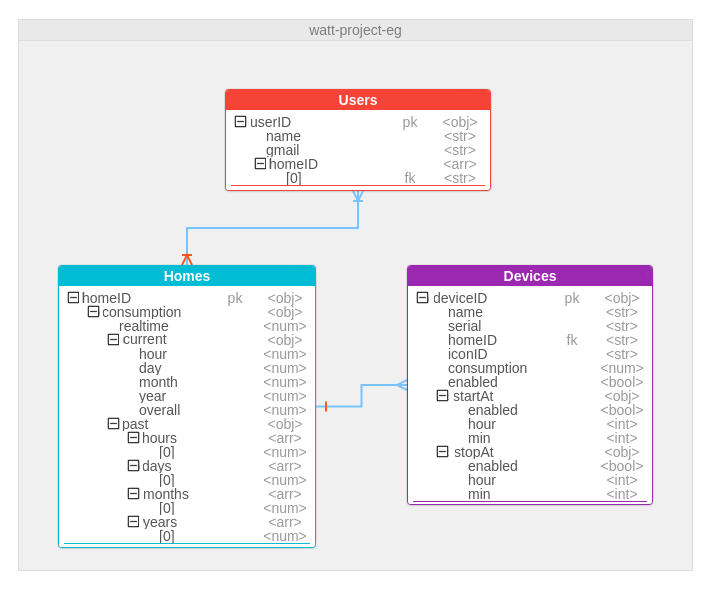
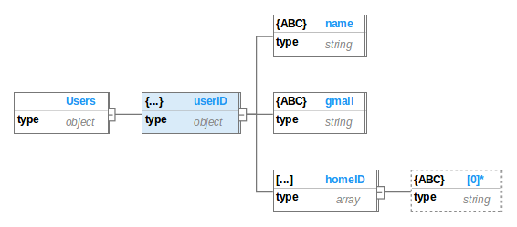
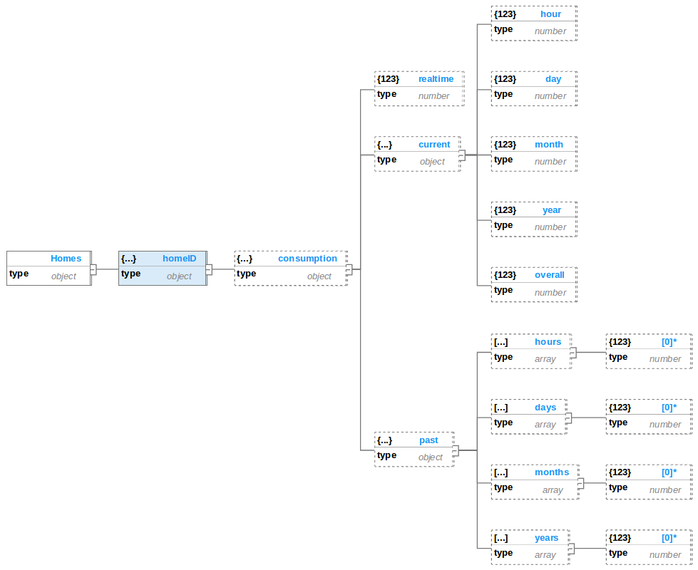
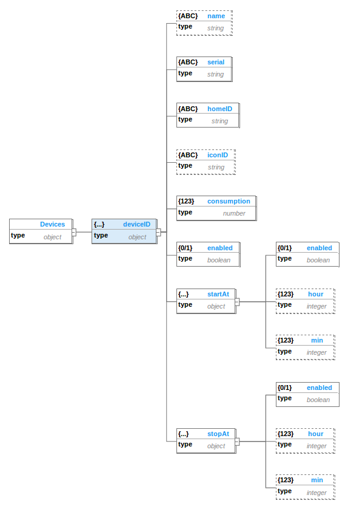
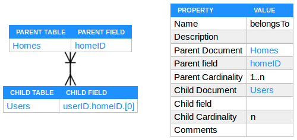

## Watt? Database

One of the services that Firebase provides is the realtime database. it is a cloud database where data is synced across all clients in realtime, and remains available when their apps goes offline. Firebase Realtime Database is a Key-value NoSQL database which emphasizes simplicity and is very useful in accelerating an application to support high-speed read and write processing of data. The application has complete control over what is stored in the value, making this the most flexible NoSQL model. Stored values has the type of object which can be string, integer, double, boolean, array or even another object and are accessed via a key.

### Watt? Database Diagrams

The Unified Modeling Language (UML) didn't stand powerless in front of the NoSQL databases, its Entity Relationship Diagram (ERD) still can be used to represent the NoSQL database models.

#### Entity Relationship Diagram

ERD is a way of mapping the relationships between different entities in the database. We still need ERD to know how exactly we are going to store data in our database, but things are little different here. Firebase Realtime Database is a Key-value NoSQL database, This means there are no Tables and Joins and we need to decide whether we are going to *embed* or *refer* an object in another object. For instance, we are creating a power monitoring system. So, we are going to store smart meters data (Homes) and consumption history (past). In this case it's a good idea to **embed** `past` object inside `Homes` object. This is one of the benefits of Key-value database i.e. you can get all the data related to the *home* with a single query. As *past* consumptions will always appear in the context of the `Homes` it's almost always a good idea to embed *past* in *home*. But what about the owners (Users) of the home? In this case we need to store a **reference** to the `Homes` inside `Users` objects.

We can still use our ERD to keep track of how we are going to store data in Firebase Realtime Database. But, in the end it comes down to - Embed or Refer? Here we have made a *modified* form of ERD which shows the embedded and referenced objects as a *tree* of objects. This diagram is built using a specialized software for modeling NoSQL databases called [Hackolade](http://hackolade.com/).

In Watt? Database we have three main entities: Users, Homes and Devices. Users refer to the Watt? Application Users, Homes refer to the homes that has at least the Watt? Smart Meter and Devices refer to the appliances that are connected with Watt? Smart Plugs. Users can own multiple Homes and Homes can have multiple multiple Devices.

#### Tree Diagram

Tree diagram is a way of representing the hierarchical nature of a structure in a graphical form. The schema for a hierarchical database consists of :

- **Boxes**, which correspond to object key, value and type.
- **Lines**, which correspond to links between objects.

Relationships formed in the graph must be such that only *one-to-many* or *one-to-one* relationships exist between a parent and a child objects. The tree diagram of Watt? Database can be represented as the following three separated trees.

##### Users Tree

When a new user starts using our Watt? Mobile Application, He will be asked to register an account using his *Google Account*. The app will create an object under the root node (Users) with the key of a generated *userID* and the value of an object containing user info (name and email) and an empty array. Then the app will ask the user to define his Watt? Smart Meters and push a references to them in the *homeID* array.

##### Homes Tree

Every newly manufactured Watt? Smart Meter has an object in the *Homes* tree. the key of this object is a 20 character string that is hard-coded in the controller of the smart meter. The Watt? Smart Meter is programmed to measure the realtime power consumption, calculate the cumulative energy consumptions and keep track of the past consumptions of the home. It will push all these data to the Firebase Realtime Database under its *homeID* object as shown in the previous diagram.

##### Devices Tree

The Watt? Smart Plug doesn't differ from the Watt? Smart Meter a lot. It is also has a hard-coded *deviceID* to store its data under the object of its key. The smart plug is programmed to store some info about the device that is plugged into it like *name* and *iconID*, measure the realtime consumption of the plugged device and control the plugged device by switching it on or off.

The user can control the plugged device as the following:
- **Immediately** by pushing the button on the smart plug or by using the mobile application.
- **At a specific time** by using the control timer feature in the mobile application.

So the *startAt* and *stopAt* objects are needed under the *Devices Tree* to handle the timer feature.

### Relationships

As we said before, Users can own multiple Homes and Homes can have multiple multiple Devices. Those are the two relationships that are shown above in the ER diagram. They can be described as :

- **Belongs To**

  

  Each user in the *Users Tree* has an array to hold his *homeIDs*. This indicates that these homes belong to that user. As the user must have at least one home (Watt? Smart Meter) and the home can belong to zero or more users, this is a many-to-many relationship.

- **Has**

  

  Each home (Watt? Smart Meter) in the *Homes Tree* can have a zero or more Devices (Watt? Smart Plugs) and every device must be connected with one home. So *Devices* must have a foreign key to the *Homes* and this should be a one-to-many relationship. 
