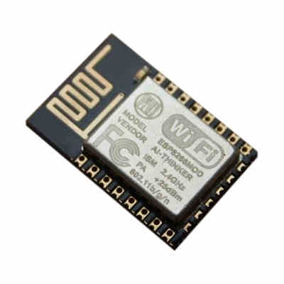
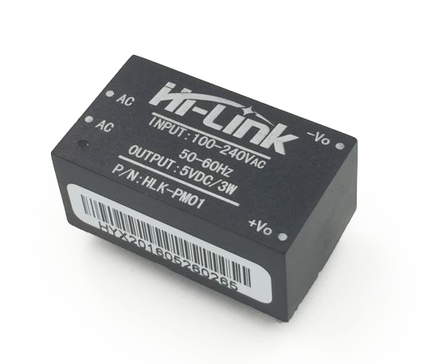
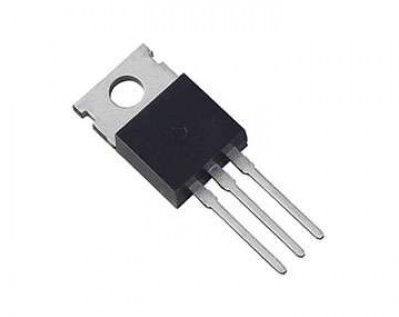
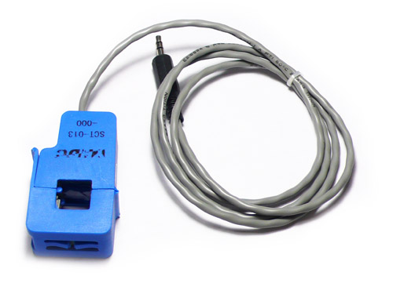
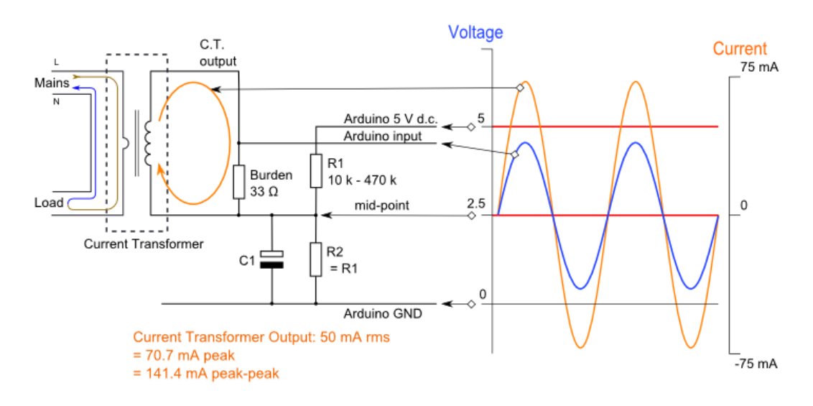
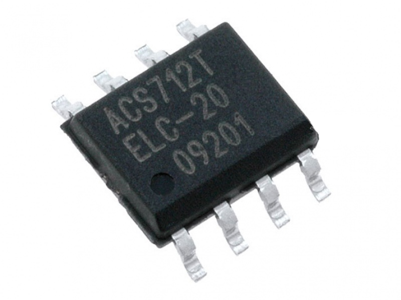
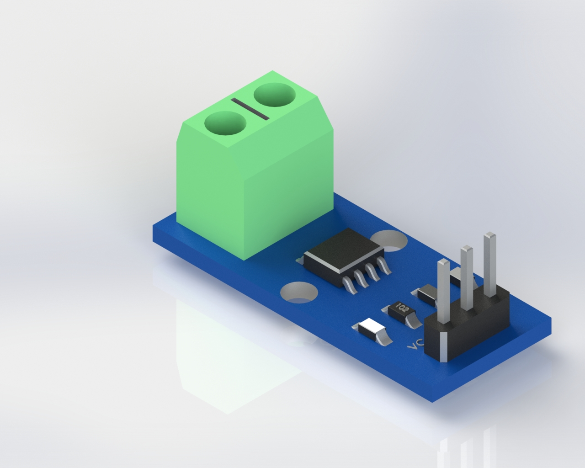
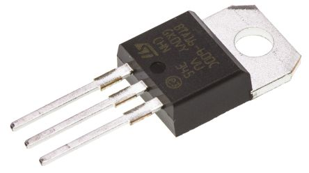

## Embedded Hardware

Embedded Hardware Design and Development is an integral part of product development. These services are intended to complement the embedded systems design and software design and development services offered. This hardware design is for microcontrollers and microprocessors or smaller FPGA systems. The hardware design, both mechanical and electronics, is done in parallel with software development.

### Embedded System Hardware Design Overview

The basic process starts with conceptual design during the embedded systems design and requirements specification phase. In this activity the requirements and conceptual design is explored further to ensure suitability for the final implementation. [1]

#### General considerations when choosing hardware

When choosing hardware, consider the following factors, which are affected by how the hardware is deployed:

- **Cost** Given the value of the data provided, think about what cost can be supported for each device.
- **I/O roles** The device might be primarily a sensor, an actuator, or some combination of the two roles.
- **Power budget** The device might have access to electricity, or power might be scarce. Think about whether the device will require battery or solar power.
- **Networking environment** Consider whether the device can be wired directly to the Internet as TCP/IP routable. Some types of connections, such as cellular, can be expensive with high traffic. Think about the reliability of the network, and the impact of that reliability on latency and throughput. If it is wireless, consider the range the transmission power achieves and the added energy costs.

#### Functional inputs and outputs

The devices used to interact with the physical world contain components, or are connected to peripherals, that enable sensor input or actuator output. The specific hardware we choose for these hardware I/O components should be based on the functional requirements. For example, the sensitivity or Intensity of the current we need to measure will determine what kind of current sensor we choose, or whether we need a current transformer instead. When using a device to produce output, we must consider requirements such as how loud a buzzer needs to sound, how fast a motor needs to turn, or how many amps a relay needs to carry.

In addition to the requirements determined by the environmental performance, the choice of these I/O components or peripherals might also be related to the type of information they are associated with. For example, a stepper motor can be set to a specific direction that might be represented in device state data, while a microphone might be steadily sampling data in terms of frequencies, which is best transmitted as telemetry. These components are connected to the logic systems of the device through a hardware interface. [2]

### Device platforms

There is an incredible amount of diversity in the specific hardware available to us for building IoT applications. This diversity starts with the options for hardware platforms. Common examples of platforms include single-board-computers such as the [Beaglebone](http://beagleboard.org/green), [Raspberry Pi](https://www.raspberrypi.org/), and Intel Edison as well as microcontroller platforms such as the [Arduino series](https://www.arduino.cc/), [ESP Chips](https://espressif.com/), boards from [Particle](https://www.particle.io/), and the [Adafruit Feather](https://www.adafruit.com/category/777).

Each of these platforms lets us connect multiple types of sensor and actuator modules through a hardware interface. These platforms interface with the modules using a layered approach similar to those used in general-purpose computing. If we think about the common, everyday computer mouse, we can consider the layers of peripheral, interface, driver and application. On a typical operating system, such as Linux or Windows, the hardware input is interpreted by a driver, which in turn relies on OS services, and might be part of the kernel.

### Watt? Hardware components

To create product concepts that will stand out from the competition, a variety of components are implemented. The world of IoT sensors and hardware is vast and incorporates a variety of components with varying qualities, sizes and functions. Here we categorize some of the major components commonly used to create Watt? products.

#### Infrastructure components

- **Microcontroller** The processor of the electronic board. This component manages communication and transmits the commands in the circuit. 

  

  Watt? Project uses the ESP8266 WiFi module. It has a built-in microcontroller, its features are :

  - 32-bit RISC CPU: Tensilica Xtensa L106 running at 80 MHz
  - 64 KiB of instruction RAM, 96 KiB of data RAM
  - External QSPI flash: 512 KiB to 4 MiB (up to 16 MiB is supported)
  - IEEE 802.11 b/g/n WiFi
    - Integrated TR switch, balun, LNA, power amplifier and matching network
    - WEP or WPA/WPA2 authentication, or open networks
  - 16 GPIO pins
  - SPI
  - I²C
  - I²S interfaces with DMA (sharing pins with GPIO)
  - UART on dedicated pins, plus a transmit-only UART can be enabled on GPIO2
  - 10-bit ADC (this is a Successive Approximation ADC)

- **Memory** The device that stores information applied by the microcontroller to operate the system and can contain information used by different components in the system. In some cases, the memory forms part of the microcontroller chip; and in cases where more memory is required, it can form a separate component. The ESP8266 WiFi Modules of Watt? have an external QSPI 4 MiB flash.

- **Communication device** The component that manages the connection to a network –making the product ‘smart’. The communication could take the form of one of a few protocols. for example, through a Bluetooth or WiFi connection. The communication module could form part of the microcontroller as in our case for the ESP8266 microcontroller chip.

#### Power supply components

- **Electricity network** Usually a viable option if the product is stationary and requires higher voltage and current. This is typically the case when applied to heating elements, heavy motors or other mechanical components and products that are in constant operation mode. In the case of Watt?, its devices are already wired to the home electricity network to measure the power consumption. So it would be better to use this the network as a power source.

  To provide Watt? devices with the 5 DC voltage they needs, We have added a power supply module to the circuit.

  

  The circuit is operated from the AC mains from 110V to 220V 50/60 Hz which is then converted to DC voltage by the AC-to-DC module with an output of 5 VDC and output current up to 600mA. It is the HLK-PM01 from Hi-Link. One Advantage of the HLK-PM01 is the small footprint 34x20x15 cm.

- **Voltage Regulator** The 5VDC is required for the circuit operation, although the WiFi module is working at 3.3VDC so a small 3.3V voltage regulator is required.

  

  So, 3.3V LM1117 LDO with a TO-220 package which has also very small footprint is used in the circuit.

#### Current Sensors

Two types of current sensor are used in Watt? Project. One for the smart meter and the other for the smart plug.

- **Current Transformer** A current transformer (CT) is a type of transformer that is used to measure AC Current. It produces an alternating current (AC) in its secondary which is proportional to the AC current in its primary. A big advantage of CT is that the metering circuit is insulated from the primary high current system.

  

  The CT used has a turns ratio of 1:0.0005 with a maximum current of 100 A which is sufficiently enough for household applications.

  Theo output voltage of the current transformer is then fed to an Analog to Digital Converter (ADC) with 10-bit accuracy embedded inside the ESP8266 WiFi module. As the output of the CT is a sin wave which varies between positive and negative value, and the ADC has a Vref of 0 volts, so an interface circuit is a necessity. The interface circuit is composed of 2 series resistors which acts as voltage divider with an output of 2.5 VDC which is required to shift the CT AC output voltage.

  

  Then the calculated consumed power is sent to a cloud server to be accessed any where.

- **ACS712 Current Sensor** A Hall Effect based current sensor is used to measure the consumed current by the devices attached to the smart plug with a maximum current measurement of 20 A.

  

  Allegro’s ACS712-20A provides economical and precise solutions for AC or DC current sensing in industrial, commercial, and communications systems. The device package allows for easy implementation. It is provided in a small, surface mount SOIC8 package.	

  

  A **current sensor module** based on the ACS712 IC could not be found in Egypt rather than the absence of soldering instruments required to solder such an small SMD IC to a printed circuit board PCB. Which if used, will assist in reducing the total size of the printed circuit board of Watt? Smart Plug.

- **Control Circuit** Watt? Smart Plug is capable to control any AC device up to 3.5 KW, a medium current snubberless Triac is used for the purpose of AC controlled switch with up to 16 A on-state RMS current which fits ideally with household applications.

  

  ST Microelectronics’s BTA16 also features a very high Repetitive peak off-state voltage of 600 V and small Triggering gate current of 50 mA. A microcontroller GPIO pin is used in corporation with a PNP transistor to supply enough triggering current to switch the Triac ON or OFF. An Indication green LED also is used to indicate the state of the device to the user.

## References

1. ["Embedded Hardware Design and Development"](http://rowebots.com/en/services/embedded-hardware-design-and-development). [rowebots.com](http://rowebots.com). June 2015.  Retrieved July 7, 2017.
2. ["Overview of Internet of Things"](https://cloud.google.com/solutions/iot-overview). Google Cloud Platform. April 19, 2017. Retrieved July 7, 2017.