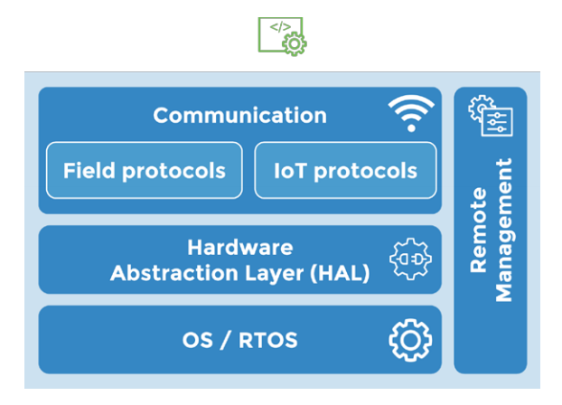
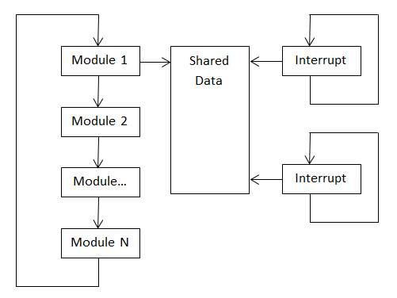

## Embedded Software

Internet of Things devices are implemented using both hardware and software components. Dedicated hardware components are used to implement the interface with the physical world, and to perform tasks which are more computationally complex. Microcontrollers are used to execute software that interprets inputs and controls the system. Now we will discusses the roles of the software components in the system. The functions of common hardware components are described and the interface between the software and hardware through the microcontroller will be explained. IoT devices often use an operating system to support the interaction between the software and the microcontroller. [1]

The “Thing” in the IoT is the starting point for an IoT solution. It is typically the originator of the data, and it interacts with the physical world. Things are often very constrained in terms of size or power supply; therefore, they are often programmed using microcontrollers (MCU) that have very limited capabilities. The microcontrollers powering IoT devices are specialized for a specific task and are designed for mass production and low cost.

### The Software Stack

The software running on MCU-based devices aims at supporting specific tasks. The key features of the software stack running on a device may include :

- **IoT Operating System** many devices like Watt? will run with ‘bare metal’, but some will have embedded or real time operating systems that are particularly suited for small constrained devices, and that can provide IoT-specific capabilities.
- **Hardware Abstraction** a software layer that enables access to the hardware features of the MCU, such as flash memory, GPIOs, serial interfaces, etc.
- **Communication Support** drivers and protocols allowing to connect the device to a wired or wireless protocol like Bluetooth, Z-Wave, Thread, CAN bus, MQTT, CoAP, etc., and enabling device communication.
- **Remote Management** the ability to remotely control the device to upgrade its firmware or to monitor its battery level. [2]

### Software Architectures for Embedded Control Systems

Software architecture, according to ANSI/IEEE Standard 1471-2000, is defined as the “fundamental organization of a system, embodied in its components, their relationships to each other and the environment, and the principles governing its design and evolution.” Embedded software, as we have said, must interact with the environment through sensors and actuators, and often has hard, real-time constraints. 

The organization of the software, or its architecture, must reflect these realities. Usually, the critical aspect of an embedded control system is its speed of response which is a function of (among other things) the processor speed and the number and complexity of the tasks to be accomplished, as well as the software architecture. Clearly, embedded systems with not much to do, and plenty of time in which to do it, can employ a simple software organization (a vending machine, for example, or the power seat in your car). Systems that must respond rapidly to many different events with hard real-time deadlines generally require a more complex software architecture (the avionics systems in an aircraft, engine and transmission control, traction control and anti-lock brakes in your car). Most often, the various tasks managed by an embedded system have different priorities: Some things have to be done immediately (fire the spark plug precisely 20◦ before the piston reaches top-dead-center in the cylinder), while other tasks may have less severe time constraints (read and store the ambient temperature for use in a calculation to be done later). 

The four software architectures that will be discussed in the following sections:

- **Round robin**
- **Round robin with interrupts**
- **Function queue scheduling**
- **Realtime operating systems [3]**

### Watt? Software Architecture

Watt? is a simple embedded system that doesn't take care of any critical constraints. By looking to the requirements of Watt? System, We could see that the most suitable architecture with low development cost is the *Round robin with interrupts* architecture.

Round robin architecture is the simplest possible software architecture; the software organization consists of one main loop wherein the processor simply polls each attached device in turn, and provides service if any is required. After all devices have been serviced, start over from the top again. One step up on the performance scale is *Round robin with interrupts*. Here, urgent tasks get handled in an interrupt service routine, possibly with a flag set for follow-up processing in the main loop. If nothing urgent happens (emergency stop button pushed, or intruder detected), then the processor continues to operate round robin, managing more mundane tasks in order around the loop.

The obvious advantage to round *Round robin with interrupts* is that the response time to high-priority tasks is improved, since the ISR always has priority over the main loop (the main loop will always stop whatever
it’s doing to service the interrupt), and yet it remains fairly simple. The worst case response time for a low
priority task is the sum of the execution times for all of the code in the main loop plus all of the interrupt
service routines.

## References

1. Ian Harris. ["Introduction to the Internet of Things and Embedded Systems"](https://www.coursera.org/instructor/ianharris). [Coursera.com](https://www.coursera.org). 
2. "The Three Software Stacks Required for IoT Architectures". Eclipse IoT. September 2016.
3. J. A. Cook and J. S. Freudenberg. ["Embedded Software Architecture"](https://www.eecs.umich.edu/courses/eecs461/lecture/SWArchitecture.pdf). EECS UMich. Fall 2008.

