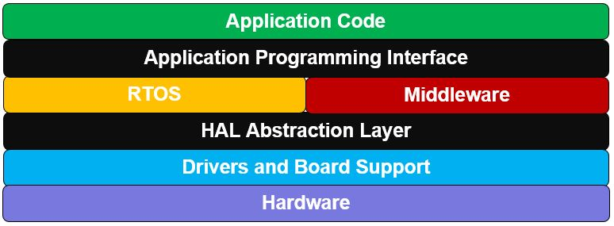

## Embedded Software

Internet of Things devices are implemented using both hardware and software components. Dedicated hardware components are used to implement the interface with the physical world, and to perform tasks which are more computationally complex. Microcontrollers are used to execute software that interprets inputs and controls the system. Now we will discusses the roles of the software components in the system. The functions of common hardware components are described and the interface between the software and hardware through the microcontroller will be explained. IoT devices often use an operating system to support the interaction between the software and the microcontroller. [1]

The “Thing” in the IoT is the starting point for an IoT solution. It is typically the originator of the data, and it interacts with the physical world. Things are often very constrained in terms of size or power supply; therefore, they are often programmed using microcontrollers (MCU) that have very limited capabilities. The microcontrollers powering IoT devices are specialized for a specific task and are designed for mass production and low cost.

### The Software Stack

The software running on MCU-based devices aims at supporting specific tasks. The key features of the software stack running on a device may include :

- **IoT Operating System** many devices like Watt? will run with ‘bare metal’ using on of the embedded software architectures below, but some will have embedded or real time operating systems that are particularly suited for small constrained devices, and that can provide IoT-specific capabilities.

- **Hardware Abstraction** Hardware Abstraction Layer (HAL) is a software layer that enables access to the hardware features of the MCU, such as flash memory, GPIOs, serial interfaces, etc. It provides function API-based service to the higher-level layers (ex: Application Framework, customer application, Et cetera) that allows them to perform hardware oriented operations independent of actual hardware details. [2]

  

  An operating system abstracts common computing resources such as memory and file I/O. The OS also provides very low-level support for the different hardware interfaces. Generally these abstractions are not easy to use directly, and frequently the OS does not provide abstractions for the wide range of sensor and actuator modules you might encounter in building IoT solutions.

  You can take advantage of libraries that abstract hardware interfaces across platforms. These libraries enable you to work with a device, such as a motion detector, in a more straightforward way. Using a library lets you focus on collecting the information the module provides to your application instead of on the low-level details of working directly with hardware.

  Some libraries provide abstractions that represent peripherals in the form of lightweight drivers on top of the hardware interfaces. Examples of these libraries include the [EMBD](https://github.com/kidoman/embd) Go library, [Arduino-wiring](https://en.wikipedia.org/wiki/Wiring_(development_platform)), [Arduino-ESP8266](https://github.com/esp8266/Arduino) and [Firmata](https://github.com/firmata/protocol). [3]

- **Communication Support** Connectivity, it is one of the main things to keep in mind while developing any Internet of Things project. Many communication technologies are well known such as WiFi, Bluetooth, ZigBee and 2G/3G/4G cellular. Depending on the application, factors such as range, data requirements, security and power demands and battery life will dictate the choice of one or some form of combination of technologies. These are some of the major communication technologies on offer to developers. We have introduced more details on IoT Networking in the previous chapter.

- **Remote Management** the ability to remotely control the device to upgrade its firmware or to monitor its battery level. [4]

### Software Architectures for Embedded Systems

Software architecture, according to ANSI/IEEE Standard 1471-2000, is defined as the “fundamental organization of a system, embodied in its components, their relationships to each other and the environment, and the principles governing its design and evolution.” Embedded software, as we have said, must interact with the environment through sensors and actuators, and often has hard, real-time constraints. 

The organization of the software, or its architecture, must reflect these realities. Usually, the critical aspect of an embedded control system is its speed of response which is a function of (among other things) the processor speed and the number and complexity of the tasks to be accomplished, as well as the software architecture. Clearly, embedded systems with not much to do, and plenty of time in which to do it, can employ a simple software organization (a vending machine, for example, or the power seat in your car). Systems that must respond rapidly to many different events with hard real-time deadlines generally require a more complex software architecture (the avionics systems in an aircraft, engine and transmission control, traction control and anti-lock brakes in your car). Most often, the various tasks managed by an embedded system have different priorities: Some things have to be done immediately (fire the spark plug precisely 20◦ before the piston reaches top-dead-center in the cylinder), while other tasks may have less severe time constraints (read and store the ambient temperature for use in a calculation to be done later).

The four software architectures that will be discussed in the following sections:

- **Round robin**
- **Round robin with interrupts**
- **Function queue scheduling**
- **Realtime operating systems**

### Watt? Software Architecture

Watt? is a simple embedded system that doesn't take care of any critical constraints. By looking to the requirements of Watt? System, We could see that the most suitable architecture with low development cost is the *Round robin with interrupts* architecture.

Round robin architecture is the simplest possible software architecture; the software organization consists of one main loop wherein the processor simply polls each attached device in turn, and provides service if any is required. After all devices have been serviced, start over from the top again. One step up on the performance scale is *Round robin with interrupts*. Here, urgent tasks get handled in an interrupt service routine, possibly with a flag set for follow-up processing in the main loop. If nothing urgent happens (emergency stop button pushed, or intruder detected), then the processor continues to operate round robin, managing more mundane tasks in order around the loop.

The obvious advantage to round *Round robin with interrupts* is that the response time to high-priority tasks is improved, since the ISR always has priority over the main loop (the main loop will always stop whatever
it’s doing to service the interrupt), and yet it remains fairly simple. The worst case response time for a low
priority task is the sum of the execution times for all of the code in the main loop plus all of the interrupt
service routines. [5]

#### Computing environment

The computing environment of our platform executes the software. These computing environments are the bridge between the logic of your application code and the physical hardware of the platform. Based on the hardware constraints of power and cost, the capabilities of the processor will vary. Some computing environments consist of a full system on a chip (SOC), which can support an embedded Linux operating system. Microcontroller-based devices might be more constrained, and your application code could run directly on the processor without the support of an operating system. [3]

Our computing environment is a full WiFi MCU SOC attached with an External 4MiB EEPROM. It has the Ability to connect to any WiFi network and also to run a WiFi Hotspot all beside executing the embedded software code at the same time. The ESP8266 WiFi MCU provides us the computing and the connectivity in a very small, low power, Very cheap, single chip.

#### Hardware Interfaces

IoT hardware platforms use a number of common interfaces. Most hardware interfaces are serial interfaces. Serial interfaces generally use multiple wires to control the flow and timing of binary information along the primary data wire. Each type of hardware interface defines a method of communicating between a peripheral and the central processor. Sensor and actuator modules can support one or more of these interfaces. The utilized interfaces in Watt? Project are:

- **GPIO**. General-purpose input/output pins are connected directly to the processor. As their name implies, these pins are provided by the manufacturer to enable custom usage scenarios that the manufacturer didn't design for. GPIO pins can be designed to carry digital or analog signals.

  - *Digital GPIO* are used in Watt? Smart Plug to control the the plugged appliance that is wired to a Triac circuit through an on-board push button. The button has a second hidden function when it is pushed for five seconds to clear the saved WiFi configurations (Network SSID and Password). This second function is implemented also in Watt? Smart Meter.
  - *Analog pins* have access to an on-board analog-to-digital conversion (ADC) circuit. An ADC periodically samples a continuous, analog waveform, such as an analog audio signal, giving each sample a digital value between zero and one, relative to the system voltage. We use the analog pin to connect the current sensor on it to get and calculate the current value that the sensor has read.

  When you read the value of a digital I/O pin in code, the value can must be either HIGH or LOW, where an analog input pin at any given moment could be any value in a range. The range depends on the resolution of the ADC. For example a 10-bit ADC can yield a wide range of values, from 0 to 1024. More values means higher resolution and thus a more faithful digital representation of any given analog signal.

  The ADC *sampling* *rate* determines the frequency range that an ADC can reproduce. A higher sampling rate results in a higher maximum frequency in the digital data. For example, an audio signal sampled at 44,100 Hz produces a digital audio file with a frequency response up to 22.5 kHz, ignoring typical filtering and other processing. The *bit precision* dictates the resolution of the amplitude of the signal.

- **SPI**. Serial Peripheral Interface Bus devices employ a master-slave architecture, with a single master and full-duplex communication. SPI specifies four logic signals:

  - SCLK: Serial Clock, which is output from the master
  - MOSI: Master Output Slave Input, which is output from the master
  - MISO: Master Input Slave Output, which is output from a slave
  - SS: Slave Select, which is an active-low signal output from master

  In Watt? Devices, SPI is connected to the external EEPROM that they use so save permanent data.

- **UART**. Universal Asynchronous Receiver/Transmitter devices translate data between serial and parallel forms at the point where the data is acted on by the processor. UART is required when serial data must be laid out in memory in a parallel fashion.
  UART is used for the debugging purposes, where some messages are printed while the code is running. We also need the UART to flash the core MCU with the embedded software.

#### On-device processing

After data is collected from a sensor, the device can provide data processing functionality before sending the data to the cloud. Processing includes things like:

- Converting data from ADC output format to a typical current value
- Calculating the realtime power consumption
- Validating data to ensure it meets a set of rules
- Handling the external interrupts
- Reading the Internet time
- Calculating the cumulative energy consumptions
- Storing data in the EEPROM
- Combining data into aggregate values

## Appendix

- The electronic circuit schematic and PCB design files can be found on circuit maker at https://circuitmaker.com/Projects/Details/Ahmed-Maher/WattProject
- The source code for Watt? Smart Meter can be found on Github at https://github.com/elzoughby/Watt-SmartMeter
- The source code for Watt? Smart Plug can be found on Github at https://github.com/elzoughby/Watt-SmartPlug
- All the book resource files and images can be found on Github at https://github.com/elzoughby/Watt-Book 

## References

1. Ian Harris. ["Introduction to the Internet of Things and Embedded Systems"](https://www.coursera.org/instructor/ianharris). [Coursera.com](https://www.coursera.org).
2. Srikar Deshmukh. ["Hardware Abstraction Layer"](http://ww1.microchip.com/downloads/en/DeviceDoc/hardware-abstraction-layer.pdf). Microchip Technology Inc.. February 2017.
3. ["Overview of Internet of Things"](https://cloud.google.com/solutions/iot-overview). Google Cloud Platform. April 19, 2017. Retrieved July 7, 2017.
4. "The Three Software Stacks Required for IoT Architectures". Eclipse IoT. September 2016.
5. J. A. Cook and J. S. Freudenberg. ["Embedded Software Architecture"](https://www.eecs.umich.edu/courses/eecs461/lecture/SWArchitecture.pdf). EECS UMich. Fall 2008.

