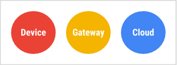
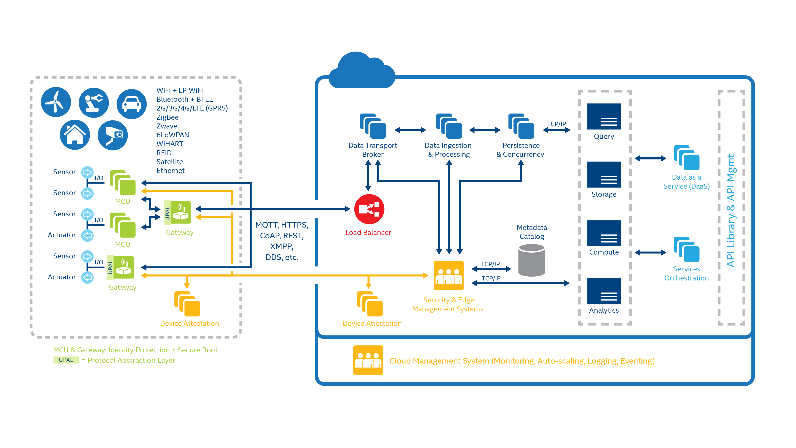

## Introduction

Internet of Things (IoT) is a sprawling set of technologies and use cases that has no clear, single definition. One workable view frames IoT as the use of network-connected devices, embedded in the physical environment, to improve some existing process or to enable a new scenario not previously possible.

These devices, or *things*, connect to the network to provide information they gather from the environment through sensors, or to allow other systems to reach out and act on the world through actuators. They could be connected versions of common objects we might already be familiar with, or new and purpose-built devices for functions not yet realized. They could be devices that we own personally and have on our persons or in our homes, or they could be embedded in factory equipment, or part of the fabric of the city we live in. Each of them is able to convert valuable information from the real world into digital data that provides increased visibility into how our users interact with our products, services, or applications.

The specific use cases and opportunities across different industries are numerous, and in many ways the world of IoT is just getting started. What emerges from these scenarios is a set of common challenges and patterns. IoT projects have additional dimensions that increase their complexity when compared to other cloud-centric technology applications, including:

- Diverse hardware.
- Diverse operating systems and software on the devices.
- Different network gateway requirements.

This chapter explains the elements we can combine with Firebase Cloud Platform to build a robust, maintainable and end-to-end IoT solution on Cloud Platform.

### Overview of the top level components

Here we divide the system into three basic components, the device, gateway, and cloud:

A *device* includes hardware and software that directly interacts with the world. Devices connect to a network to communicate with each other, or to centralized applications. Devices might be directly or indirectly connected to the Internet.

A *gateway* enables devices that are not directly connected to the Internet to reach cloud services. Although the term *gateway* has a specific function in networking, it is also used to describe a class of device that processes data on behalf of a group or cluster of devices. The data from each device is sent to Cloud Platform, where it is processed and combined with data from other devices, and potentially with other business-transactional data.

### Internet Of Things Architecture

Here is the detailed architecture design of the cloud-based Internet Of Things according to the top level components.

We have discussed in details the the *Cloud* and the *Gateway* components in the previous chapters. Here we will talk about the *Device* component at the left side of the previous figure. This chapter explains in details the construction of the *Device* component in the cloud-based Internet Of Things project for Watt?. 

## References

1. ["Overview of Internet of Things"](https://cloud.google.com/solutions/iot-overview). Google Cloud Platform. April 19, 2017. Retrieved July 7, 2017.
2. ["Intel steps into the Internet of platforms"](https://rickbouter.wordpress.com/2014/12/10/intel-steps-into-the-internet-of-platforms/). Intel® IoT Platform. 2014. Retrieved July 7, 2017.