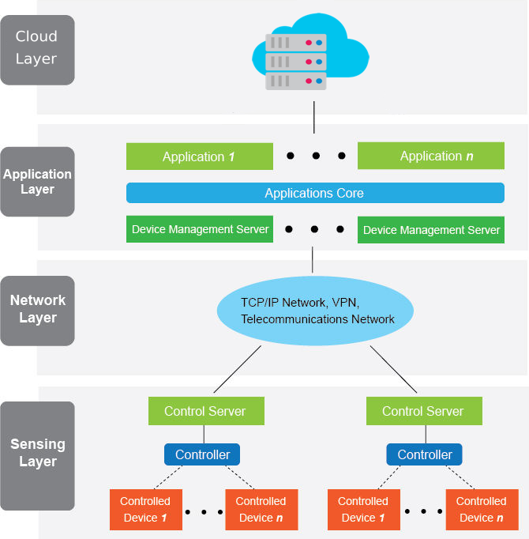

## Introduction

More more embedded devices and sensors are connected to each other and to the Internet. Then the devices can be remotely controllable and their data accessible any where using any kind of devices the users might have. This is the Internet of Things.

Watt? is a simple implementation of the the Internet of Things. It features these smart devices all equipped with high current sensors connected with an embedded devices. The devices are connected to a cloud server where it streams the data along with storing it locally in the device. From the cloud server you can access the devices data from any Android mobile device.

Watt? is a system to measure the power consumption, calculate the energy consumption and control some appliances of the home remotely. We are trying to smarten up some existing physical things like electricity meters and electricity plugs by connecting them wireless to the *Internet* and this is the Internet of Things.

The three major components of our product can be described as the following:

- **Watt? Smart Meter**

  An Internet connected electricity meter to measure the overall power consumption and the cumulative energy consumption of the home. Then to send that data to a back-end cloud server through the Internet.

- **Watt? Smart Plug**

  An external plug to measure the realtime power consumption of the plugged appliance and to make it controllable remotely through an Internet connected mobile device.

- **Watt? Mobile Application**

  The main Interface for the users to deal with all the system features. It makes them able to monitor their power and energy consumptions, control the plugged appliances and expect the bill cost. all of that can be accessed remotely any where.

## Internet of Things

The closest to an official definition of the Internet of Things comes from the Internet of Things Global Standards Initiative: The Internet of Things (IoT) is the network of physical objects or “things” embedded with electronics, software, sensors, and network connectivity, which enables these objects to collect and exchange data. That’s a high-level definition, and the IoT goes by other names as well.

### Advantagesof IOT

- **Communication**	IoT encourages the communication between devices, also famously known as Machine-to-Machine (M2M) communication. Because of this, the physical devices are able to stay connected and hence the total	transparency is available with lesser inefficiencies and greater	quality.

- **Automation and Control** Due to physical objects getting connected and controlled digitally and	centrally with wireless infrastructure, there is a large amount of automation and control in the workings. Without human intervention,	the machines are able to communicate with each other leading to faster and timely output.

- **Information** it is obvious that having more information helps making better decisions. Whether it is mundane decisions as needing to know what to buy at the grocery store or if your company has enough widgets and supplies, knowledge is power and more knowledge is better.

- **Monitor** The second most obvious advantage of IoT is monitoring. Knowing the	exact quantity of supplies or the air quality in your home, can	further provide more information that could not have previously been collected easily. For instance, knowing that you are low on milk or printer ink could save you another trip to the store in the near future. Furthermore, monitoring the expiration of products can and	will improve safety.

  - **Time** As hinted in the previous examples, the amount of time saved because of IoT could be quite large. And in today’s modern life, we all	could use more time.

  - **Money **The biggest advantage of IoT is saving money. If the price of the tagging and monitoring equipment is less than the amount of money saved, then the Internet of Things will be very widely adopted. IoT fundamentally proves to be very helpful to people in their daily routines by making the appliances communicate to each other in an effective manner thereby saving and conserving energy and cost. Allowing the data to be communicated and shared between devices and then translating it into our required way, it makes our systems efficient.

  - **Automation of daily tasks leads to better monitoring of devices** The IoT allows you to automate and control the tasks that are done on a daily basis, avoiding human intervention. Machine-to-machine	communication helps to maintain transparency in the processes. It also leads to uniformity in the tasks. It can also maintain the quality of service. We can also take necessary action in case of emergencies.

  - **Efficient and Saves Time** The machine-to-machine interaction provides better efficiency, hence;	accurate results can be obtained fast. This results in saving valuable time. Instead of repeating the same tasks every day, it enables people to do other creative jobs.

  - **Saves Money** Optimum utilization of energy and resources can be achieved by adopting this	technology and keeping the devices under surveillance. We can be alerted in case of possible bottlenecks, breakdowns, and damages to the system. Hence, we can save money by using this technology.

  - **Better Quality of Life** All the applications of this technology culminate in increased comfort, convenience, and better management, thereby improving the quality of life.

### Internet of Things Architecture

The layered architecture for Internet Of Things in Watt? Project depends on four layers as the traditional layered architecture. This architecture is illustrated in this figure:

- **Cloud layer**

   IoT systems frequently involve the use of cloud computing platforms. Cloud computing platforms offer the potential to use large amounts of resources, both in terms of the storage of data and also in the ability to bring flexible and scalable processing resources to the analysis of data. Cloud computing is given primacy because it provides great flexibility and scalability. It offers services such as the core infrastructure, platform, software, and storage. Developers can provide their storage tools, software tools, data mining, and machine learning tools, and visualization tools through the cloud.

- **Application layer** 

  includes the IoT application. This layer is responsible for delivery of various applications to different users in IoT. The applications can be from different industry segments such as: manufacturing, logistics, retail, environment, public safety, health-care, food and drug etc.

- **Network layer**

  performs the following functions; Gateway – Routing & Addressing – Network Capabilities – Transport Capabilities – Error detection & Correction. Also, it takes care of message routing, publishing and subscribing. With demand needed to serve a wider range of IOT services and applications such as high speed transactional services, context-aware applications, etc, multiple networks with various technologies and access protocols are needed to work with each other in a heterogeneous configuration. These networks can be in the form of a private, public or hybrid models and are built to support the communication requirements for latency, bandwidth or security.

- **Hardware layer**

  includes sensors, other hardware such as; embedded systems, RFID tags and readers and others. The sensors enable the interconnection of the physical and digital worlds allowing real-time information to be collected and processed. The miniaturization of hardware has enabled powerful sensors to be produced in much smaller forms which are integrated into objects in the physical world. There are various types of sensors for different purposes. The sensors have the capacity to take measurements such as temperature, air quality, movement and electricity. In some cases, they may also have a degree of memory, enabling them to record a certain number of measurements. A sensor can measure the physical property and convert it into signal that can be understood by an instrument. Sensors are grouped according to their unique purpose such as environmental sensors, body sensors, home appliance sensors and vehicle telemetric sensors, etc. Many of these hardware elements provide identification and information storage (e.g. RFID tags), information collection (e.g. sensors), and information processing (e.g. embedded edge processors).

  ​

In the next chapters, We will discuss in details the development fields of Watt? Project from the perspective of the Internet Of Things architecture layers.

## References

- Dina Gamal Darwish (2015). ["Improved Layered Architecture for Internet of Things"](http://www.meacse.org/ijcar/archives/71.pdf). *www.meacse.org/ijcar/*.  pp.214-223. ISSN 2305-9184 Volume 4