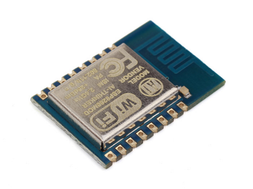

## Introduction

An important aspect of the Internet of Things is that devices are networked in some way, and often connected to the Internet. Networking enables devices to communicate with other IoT devices and larger cloud-based servers. IoT devices can often be thought of as small parts of a much larger collective system which includes large servers based in the cloud. This chapter will introduce the networking and the Internet protocol in particular. Eventually, most IoT devices are connected to the Internet, so understanding the protocols associated with the Internet is important to the design of IoT devices. [1]

## Communication

As the Internet of Things is growing very rapidly, there are a large number of heterogeneous smart devices connecting to the Internet. IoT devices are battery powered, with minimal compute and storage resources. Because of their constrained nature, there are various communication challenges involved, which are as follows :

- **Addressing and identification**: since millions of smart things will be connected to the Internet, they will have to be identified through a unique address, on the basis of which they communicate with each other. For this, we need a large addressing space, and a unique address for each smart object.
- **Low power communication**: communication of data between devices is a power consuming task, specially, wireless communication. Therefore, we need a solution that facilitates communication with low power consumption.
- Routing protocols with low memory requirement and efficient communication patterns.
- High speed and non-lossy communication.
- Mobility of smart things.

IoT devices typically connect to the Internet through the IP (Internet Protocol) stack. This stack is very complex and demands a large amount of power and memory from the connecting devices. The IoT devices can also connect locally through non-IP networks, which consume less power, and connect to the Internet via a smart gateway. Non-IP communication channels such as Bluetooth, RFID, and NFC are fairly popular but are limited in their range (up to a few meters). Therefore, their applications are limited to small personal area networks. Personal area networks (PAN) are being widely used in IoT applications such as wearables connected to smartphones. For increasing the range of such local networks, there was a need to modify the IP stack so as to facilitate low power communication using the IP stack.

The leading communication technologies used in the IoT world are IEEE 802.15.4, low power WiFi, 6LoWPAN, RFID, NFC, Sigfox, LoraWAN, and other proprietary protocols for wireless networks.

### IoT Network Protocol Stack

The Internet Engineering Task Force (IETF) has developed alternative protocols for communication between IoT devices using IP because IP is a flexible and reliable standard. The Internet Protocol for Smart Objects (IPSO) Alliance has published various white papers describing alternative protocols and standards for the layers of the IP stack and an additional adaptation layer, which is used for communication between smart objects.

1. **Physical and MAC Layer (IEEE 802.15.4)**. The IEEE 802.15.4 protocol is designed for enabling communication between compact and inexpensive low power embedded devices that need a long battery life. It defines standards and protocols for the physical and link (MAC) layer of the IP stack. It supports low power communication along with low cost and short range communication. In the case of such resource constrained environments, we need a small frame size, low bandwidth, and low transmit power.

   Transmission requires very little power (maximum one milliwatt), which is only one percent of that used in WiFi or cellular networks. This limits the range of communication. Because of the limited range, the devices have to operate cooperatively in order to enable multihop routing over longer distances. As a result, the packet size is limited to 127 bytes only, and the rate of communication is limited to 250 kbps. The coding scheme in IEEE 802.15.4 has built in redundancy, which makes the communication robust, allows us to detect losses, and enables the retransmission of lost packets. The protocol also supports short 16-bit link addresses to decrease the size of the header, communication overheads, and memory requirements.

2. **Adaptation Layer**. IPv6 is considered the best protocol for communication in the IoT domain because of its scalability and stability. Such bulky IP protocols were initially not thought to be suitable for communication in scenarios with low power wireless links such as IEEE 802.15.4.

   6LoWPAN, an acronym for IPv6 over low power wireless personal area networks, is a very popular standard for wireless communication. It enables communication using IPv6 over the IEEE 802.15.4 protocol. This standard defines an adaptation layer between the 802.15.4 link layer and the transport layer. 6LoWPAN devices can communicate with all other IP based devices on the Internet. The choice of IPv6 is because of the large addressing space available in IPv6. 6LoWPAN networks connect to the Internet via a gateway (WiFi or Ethernet), which also has protocol support for conversion between IPv4 and IPv6 as today’s deployed Internet is mostly IPv4. IPv6 headers are not small enough to fit within the small 127 byte MTU of the 802.15.4 standard. Hence, squeezing and fragmenting the packets to carry only the essential information is an optimization that the adaptation layer performs.

3. **Network Layer**. The network layer is responsible for routing the packets received from the transport layer. The IETF Routing over Low Power and Lossy Networks (ROLL) working group has developed a routing protocol (RPL) for Low Power and Lossy Networks (LLNs).

   For such networks, RPL is an open routing protocol, based on distance vectors. It describes how a destination oriented directed acyclic graph (DODAG) is built with the nodes after they exchange distance vectors. A set of constraints and an objective function is used to build the graph with the best path. The objective function and constraints may differ with respect to their requirements. For example, constraints can be to avoid battery powered nodes or to prefer encrypted links. The objective function can aim to minimize the latency or the expected number of packets that need to be sent.

4. **Transport Layer**. TCP is not a good option for communication in low power environments as it has a large overhead owing to the fact that it is a connection oriented protocol. Therefore, UDP is preferred because it is a connectionless protocol and has low overhead.

5. **Application Layer**. The application layer is responsible for data formatting and presentation. The application layer in the Internet is typically based on HTTP. However, HTTP is not suitable in resource constrained environments because it is fairly verbose in nature and thus incurs a large parsing overhead. Many alternate protocols have been developed for IoT environments such as CoAP (Constrained Application Protocol) and MQTT (Message Queue Telemetry Transport).

#### Low Power WiFi

The WiFi alliance has recently developed “WiFi HaLow,” which is based on the IEEE 802.11ah standard. It consumes lower power than a traditional WiFi device and also has a longer range. This is why this protocol is suitable for Internet of Things applications. The range of WiFi HaLow is nearly twice that of traditional WiFi.

Like other WiFi devices, devices supporting WiFi HaLow also support IP connectivity, which is important for IoT applications. Let us look at the specifications of the IEEE 802.11ah standard. This standard was developed to deal with wireless sensor network scenarios, where devices are energy constrained and require relatively long range communication. IEEE 802.11ah operates in the sub-gigahertz band (900 MHz). Because of the relatively lower frequency, the range is longer since higher frequency waves suffer from higher attenuation. We can extend the range (currently 1 km) by lowering the frequency further; however, the data rate will also be lower and thus the tradeoff is not justified. IEEE 802.11ah is also designed to support large star shaped networks, where a lot of stations are connected to a single access point.

## Watt? Networking

Due to the popularity of WiFi for all people, Watt? uses it to connect to the Internet. Every Watt? device has a built-in WiFi supported microcontroller. It needs to connect to a WiFi router to start working properly. Here we will introduce more details about WiFi.

### WiFi

WiFi is simply an alternative to network cables as a way to connect devices of a local area network (LAN). Prior to WiFi the only way to connect devices together was to run physical network cables between them, which can be inconvenient. WiFi allows devices to connect to one another the same way as when network cables are used, just without the actual cables. A WiFi network is basically a wireless local network.

The owner of the WiFi network is in total control. She can change the name of the network, the password, the number of connected clients, allowing them to exchange data with one another or not, and so on. Even the WiFi router or access point itself can be changed or turned on or off any time.

A home WiFi network, which is almost always hosted by a router, is independent from the Internet. Meaning that any devices on the network can always work with one another to share and back up data, print, stream local media and so on. A connection to the Internet, however, enables them to also access Internet-based services, such as Skype, Netflix, news, Facebook, Twitter and other services.

To connect a home WiFi network to the Internet, the router needs to be connected to an Internet source, such as a broadband modem, via its WAN port. When this link is complete, the WiFi signal of the local network will also provide a connection to the Internet for any device connected to the network. So WiFi is just one way to bring the Internet to a device. And this also explains why sometimes our WiFi signal is at full strength, yet we still can't access the Internet.

### Internet

Generally known as the wide area network (WAN), the Internet connects computers from around the world. In reality, the Internet actually connects many local networks together, via a ton of routers. With the Internet, our home local network is no longer secluded but becomes part of one giant worldwide network.

The Internet connection is generally beyond the control of the users. Other than turning it on or off, the only other thing we can do is pay for the desired connection speed and hope we get what we pay for. Internet speed has progressively increased in the last decade. Ten years ago, a fast residential broadband connection generally capped somewhere between 1.5Mbps to 20Mbps; now it's between about 50Mbps to 150Mbps and even faster.

That said, most of the time, the speed of the Internet is still slower than that of a wired local network, which is either 100Mbps or 1,000Mbps. For a WiFi network, the speed of the local network depends on the standards used by the WiFi router (or access point) and the connected clients, and can sometimes be slower than a fast broadband wired Internet connection.

### ESP8266 WiFi Module

As mentioned before, Watt? uses the *ESP8266 WiFi Module* as the core control and communication device.

The ESP8266 WiFi Module is a self contained SOC with integrated TCP/IP protocol stack that can give any microcontroller access to your WiFi network. The ESP8266 is capable of either hosting an application or offloading all WiFi networking functions from another application processor. Each ESP8266 module comes pre-programmed with an AT command set firmware, meaning, we can simply hook this up to an Arduino device and get a WiFi-ability very easily. The ESP8266 module is an extremely cost effective board with a huge, and ever growing, community.

This module has a powerful enough on-board processing and storage capability that allows it to be integrated with the sensors and other application specific devices through its GPIOs with minimal development up-front and minimal loading during runtime. Its high degree of on-chip integration allows for minimal external circuitry, including the front-end module, is designed to occupy minimal PCB area. The ESP8266 supports APSD for VoIP applications and Bluetooth co-existance interfaces, it contains a self-calibrated RF allowing it to work under all operating conditions, and requires no external RF parts.

There is an almost limitless fountain of information available for the ESP8266, all of which has been provided by amazing community support. In the *Documents* section below you will find many resources to aid you in using the ESP8266, even instructions on how to transforming this module into an Internet of Things solution!

## References

1. Ian Harris. ["Introduction to the Internet of Things and Embedded Systems"](https://www.coursera.org/instructor/ianharris). [Coursera.com](https://www.coursera.org/).
2. allavi Sethi and Smruti R. Sarangi (2017). ["Internet of Things: Architectures, Protocols, and Applications"](https://www.hindawi.com/journals/jece/2017/9324035/). Journal of Electrical and Computer Engineering. Article ID 9324035, 25 pages. Volume 2017.